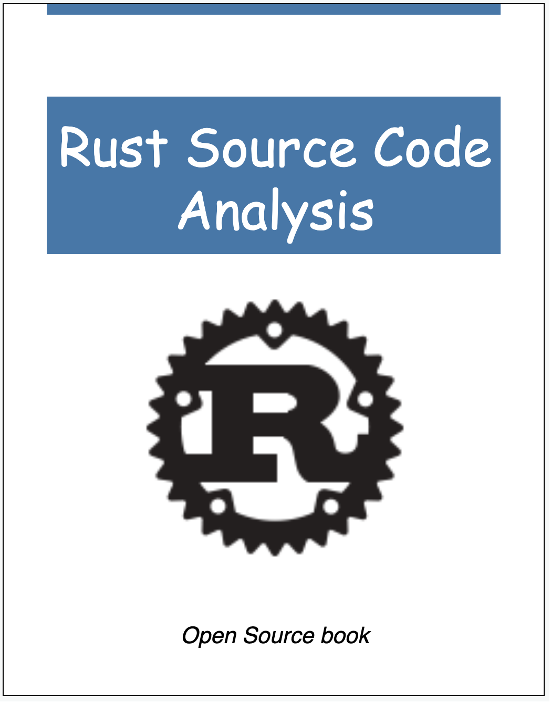

# Rust Source Code Analysis

[English](https://github.com/awesome-kusion/rust-code-book) [简体中文](https://github.com/awesome-kusion/rust-code-book-zh)

- *KusionStack(Go): <https://github.com/KusionStack/kusion>*
- *KCLVM(Rust): <https://github.com/KusionStack/KCLVM>*

## Preface

When I was working on KusionStack and KCLVM projects, I started to learn the source code of Rustc with the idea of learning the design of excellent compiler. I took some notes and documents during this process. With the suggestion of [Chai](https://github.com/chai2010), I organized them into an article and posted it. I didn't expect people to be interested in it, so I decided to continue writing articles on Rustc source code analysis. This is the original intention of writing this e-book.

KCLVM is a compiler we developed with Rust in the project of Kusion, and some parts of this book are applied to KCLVM. If you are interested in the cloud-native ecology and technology, you can learn about the project &#x1F449; [KusionStack](https://github.com/KusionStack/kusion). And if you are interested in Rust, programming languages or compilers, maybe you prefer &#x1F449; [KCLVM]( https://github.com/KusionStack/KCLVM).

Finally, most of the content in these e-book are my personal understanding when reading the source code, as well as some descriptions in the [rust-dev-guide](https://rustc-dev-guide.rust-lang.org/about-this-guide.html). Owing to the limitation of my knowledge, there must be mistakes and errors in the book. So we welcome all forms of conrtibutions(fix typo/polish english/translation/write article or other) from everyone.

---

## E-book

Target: Analysis and learn from the source code of Rust standard library, Rust compiler(Rustc) and open source project written by Rust.

- Github Repo: [https://github.com/awesome-kusion/rust-code-book](https://github.com/awesome-kusion/rust-code-book)
- Read Online: [https://awesome-kusion.github.io/rust-code-book](https://awesome-kusion.github.io/rust-code-book)

## Catalog

[Preface](preface.md)

- [Intro](intro/readme.md)
- [Standard Library](stdlib/readme.md)
- [Rust Compiler](rustc/readme.md)
  - [Overview](rustc/overview/readme.md)
  - [Invocation](rustc/invocation/readme.md)
  - [Lexer](rustc/lexer/readme.md)
  - [Parser](rustc/parser/readme.md)
    <!-- - [AST](rustc/parser/ast/readme.md)
      - [AST definition](rustc/parser/ast/ast.md)
      - [Visitor](rustc/parser/ast/visitor.md)
    - [EarlyLint](rustc/parser/early-lint/readme.md) -->
  - [Sema](rustc/sema/readme.md)
    - [Lint](rustc/sema/lint/readme.md) &#x2705;
      <!-- - [Lint and LintPass](rustc/sema/lint/lint-pass.md) &#x2705;
      - [CombinedLintPass](rustc/sema/lint/combinedlintpass.md) &#x2705;
      - [Execution Process[WIP]](rustc/sema/lint/lint.md)  &#x1F552; -->
    <!-- - [Resolver](rustc/sema/resovler/readme.md)
    - [HIR lowering](rustc/sema/hir-lowering/readme.md)
      - [Trait solving](rustc/sema/hir-lowering/trait-solving/readme.md)
      - [Type Inference](rustc/sema/hir-lowering/type-inference/readme.md)
      - [Type Checking](rustc/sema/hir-lowering/type-checking/readme.md)
      - [LateLint](rustc/sema/late-lint/readme.md)
    - [MIR lowering](rustc/sema/mir-lowering/readme.md)
      - [Borrow checking](rustc/sema/mir-lowering/borrow-check/readme.md)
      - [MIR Optimized](rustc/sema/mir-lowering/mir-optimized/readme.md) -->
  - [Codegen](rustc/codegen/readme.md)
  - [General](rustc/general/readme.md)
    - [Errors[WIP]](rustc/general/errors/readme.md)  &#x1F552;
    - [SourceMap & Span[WIP]](rustc/general/sourcemap-span/readme.md)  &#x1F552;

- [Rust Tools](rust-tools/readme.md)
  <!-- - [Cargo](rust-tools/cargo/readme.md)
  - [Clippy](rust-tools/clippy/readme.md) -->

- [Rust Open Source Project](open-source/readme.md)
  - [KCLVM](open-source/KCLVM/readme.md) &#x2705;
- [Appendix](appendix/readme.md)

---

- Twitter: [He1pa](https://twitter.com/ZhengZh79945795)
- Wechat QR code:

