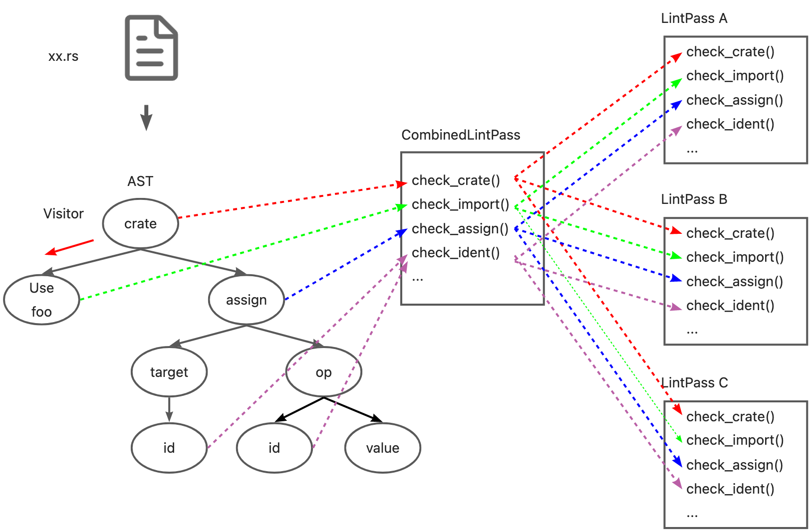

# CombinedLintPass

## CombinedLintpass

Rustc 在 `LintPass` 的中实现了 `Lint` 工具检查的具体逻辑。并且使用 Visitor 模式遍历 AST 的同时调用 lintpass 中的 `check_*`方法。

```rust
impl ast_visit::Visitor for Linter {
    fn visit_crate(a: ast:crate){
        for lintpass in lintpasses{
            lintpass.check_crate(a)
        }
        walk_crate();
    }
    fn visit_stmt(a: ast:stmt){
        for lintpass in lintpasses{
            lintpass.check_stmt(a)
        }
        walk_stmt();
    }
    ...
}
```

但是，Rustc 自身和 clippy 提供的 Lint 定义多达550+多个。考虑到性能因素，定义大量的 LintPass，分别注册和调用显然是不合适的。Rustc 提供了一种更优的解决方法：既然可以将多个 Lint 组织为一个 LintPass，同样也可以将多个 LintPass 组合成一个 CombinedLintPass。
> [Compiler lint passes are combined into one pass](https://rustc-dev-guide.rust-lang.org/diagnostics/lintstore.html#compiler-lint-passes-are-combined-into-one-pass)
> Within the compiler, for performance reasons, we usually do not register dozens of lint passes. Instead, we have a single lint pass of each variety (e.g., BuiltinCombinedModuleLateLintPass) which will internally call all of the individual lint passes; this is because then we get the benefits of static over dynamic dispatch for each of the (often empty) trait methods.
> Ideally, we'd not have to do this, since it adds to the complexity of understanding the code. However, with the current type-erased lint store approach, it is beneficial to do so for performance reasons.

### BuiltinCombinedEarlyLintPass

CombinedLintPass 同样分为 early 和 late 两类。 以 builtin 的 early lint 为例，Rustc 在 `rustc_lint::src::lib.rs` 中为这些 lintpass 定义了一个 `BuiltinCombinedEarlyLintPass` 结构。

```rust
early_lint_passes!(declare_combined_early_pass, [BuiltinCombinedEarlyLintPass]);
```

虽然这个定义看起来只有一行，但其中通过若干个宏的展开，汇总了14个 `LintPass`，并且每个 `LintPass` 提供了50多个 `check_*` 方法。接下来一一说明这些宏。

#### BuiltinCombinedEarlyLintPass 的宏定义

##### early_lint_passes

```rust
macro_rules! early_lint_passes {
    ($macro:path, $args:tt) => {
        $macro!(
            $args,
            [
                UnusedParens: UnusedParens,
                UnusedBraces: UnusedBraces,
                UnusedImportBraces: UnusedImportBraces,
                UnsafeCode: UnsafeCode,
                AnonymousParameters: AnonymousParameters,
                EllipsisInclusiveRangePatterns: EllipsisInclusiveRangePatterns::default(),
                NonCamelCaseTypes: NonCamelCaseTypes,
                DeprecatedAttr: DeprecatedAttr::new(),
                WhileTrue: WhileTrue,
                NonAsciiIdents: NonAsciiIdents,
                HiddenUnicodeCodepoints: HiddenUnicodeCodepoints,
                IncompleteFeatures: IncompleteFeatures,
                RedundantSemicolons: RedundantSemicolons,
                UnusedDocComment: UnusedDocComment,
            ]
        );
    };
}
```

首先是 early_lint_passes 宏，这个宏的主要作用是定义了所有的 early lintpass。这里的 lintpass 是成对出现的，`:`左边为 lintpass 的 Identifier，`:`右边为 lintpass 的constructor。所以会出现 `EllipsisInclusiveRangePatterns::default()` 和 `DeprecatedAttr::new()`这种形式。early_lint_passes 会将定义的 early lintpass 和 第二个参数一起传递给下一个宏。
通过这个宏，之前的`BuiltinCombinedEarlyLintPass`的定义被展开为：

```rust
declare_combined_early_pass!([BuiltinCombinedEarlyLintPass], [
                UnusedParens: UnusedParens,
                UnusedBraces: UnusedBraces,
                UnusedImportBraces: UnusedImportBraces,
                UnsafeCode: UnsafeCode,
                AnonymousParameters: AnonymousParameters,
                EllipsisInclusiveRangePatterns: EllipsisInclusiveRangePatterns::default(),
                NonCamelCaseTypes: NonCamelCaseTypes,
                DeprecatedAttr: DeprecatedAttr::new(),
                WhileTrue: WhileTrue,
                NonAsciiIdents: NonAsciiIdents,
                HiddenUnicodeCodepoints: HiddenUnicodeCodepoints,
                IncompleteFeatures: IncompleteFeatures,
                RedundantSemicolons: RedundantSemicolons,
                UnusedDocComment: UnusedDocComment,
            ])
```

##### declare_combined_early_pass

```rust
macro_rules! declare_combined_early_pass {
    ([$name:ident], $passes:tt) => (
        early_lint_methods!(declare_combined_early_lint_pass, [pub $name, $passes]);
    )
}
```

declare_combined_early_pass 宏接收 early_lint_passes宏传来的 name(BuiltinCombinedEarlyLintPass) 和 passes，并继续传递给 early_lint_methods 宏。
通过这个宏，`BuiltinCombinedEarlyLintPass`的定义继续展开为：

```rust
early_lint_methods!(declare_combined_early_lint_pass, 
                    [pub BuiltinCombinedEarlyLintPass, 
                      [
                            UnusedParens: UnusedParens,
                            UnusedBraces: UnusedBraces,
                            UnusedImportBraces: UnusedImportBraces,
                            UnsafeCode: UnsafeCode,
                            AnonymousParameters: AnonymousParameters,
                            EllipsisInclusiveRangePatterns: EllipsisInclusiveRangePatterns::default(),
                            NonCamelCaseTypes: NonCamelCaseTypes,
                            DeprecatedAttr: DeprecatedAttr::new(),
                            WhileTrue: WhileTrue,
                            NonAsciiIdents: NonAsciiIdents,
                            HiddenUnicodeCodepoints: HiddenUnicodeCodepoints,
                            IncompleteFeatures: IncompleteFeatures,
                            RedundantSemicolons: RedundantSemicolons,
                            UnusedDocComment: UnusedDocComment,
               ]
                    ]);
```

##### early_lint_methods

```rust
macro_rules! early_lint_methods {
    ($macro:path, $args:tt) => (
        $macro!($args, [
            fn check_param(a: &ast::Param);
            fn check_ident(a: &ast::Ident);
            fn check_crate(a: &ast::Crate);
            fn check_crate_post(a: &ast::Crate);
            ...
        ]);
    )
}
```

early_lint_methods 宏在前一篇文章中也介绍过，它定义了 `EarlyLintPass` 中需要实现的 `check_*`函数，并且将这些函数以及接收的参数 `$args`传递给下一个宏。因为 `BuiltinCombinedEarlyLintPass` 也是 early lint 的一种，所以同样需要实现这些函数。
通过这个宏，`BuiltinCombinedEarlyLintPass`的定义继续展开为：

```rust
declare_combined_early_lint_pass!(
    [pub BuiltinCombinedEarlyLintPass, 
        [
            UnusedParens: UnusedParens,
            UnusedBraces: UnusedBraces,
            UnusedImportBraces: UnusedImportBraces,
            UnsafeCode: UnsafeCode,
            AnonymousParameters: AnonymousParameters,
            EllipsisInclusiveRangePatterns: EllipsisInclusiveRangePatterns::default(),
            NonCamelCaseTypes: NonCamelCaseTypes,
            DeprecatedAttr: DeprecatedAttr::new(),
            WhileTrue: WhileTrue,
            NonAsciiIdents: NonAsciiIdents,
            HiddenUnicodeCodepoints: HiddenUnicodeCodepoints,
            IncompleteFeatures: IncompleteFeatures,
            RedundantSemicolons: RedundantSemicolons,
            UnusedDocComment: UnusedDocComment,
        ]
    ],
    [
        fn check_param(a: &ast::Param);
        fn check_ident(a: &ast::Ident);
        fn check_crate(a: &ast::Crate);
        fn check_crate_post(a: &ast::Crate);
        ...
    ]
)
```

##### declare_combined_early_lint_pass

```rust
macro_rules! declare_combined_early_lint_pass {
    ([$v:vis $name:ident, [$($passes:ident: $constructor:expr,)*]], $methods:tt) => (
        #[allow(non_snake_case)]
        $v struct $name {
            $($passes: $passes,)*
        }
        impl $name {
            $v fn new() -> Self {
                Self {
                    $($passes: $constructor,)*
                }
            }
            $v fn get_lints() -> LintArray {
                let mut lints = Vec::new();
                $(lints.extend_from_slice(&$passes::get_lints());)*
                lints
            }
        }
        impl EarlyLintPass for $name {
            expand_combined_early_lint_pass_methods!([$($passes),*], $methods);
        }
        #[allow(rustc::lint_pass_impl_without_macro)]
        impl LintPass for $name {
            fn name(&self) -> &'static str {
                panic!()
            }
        }
    )
}
```

declare_combined_early_lint_pass宏是生成 `BuiltinCombinedEarlyLintPass` 的主体。这个宏中做了以下工作：

- 生成一个名为 `BuiltinCombinedEarlyLintPass` 的 struct，其中的属性为宏 `early_lint_passes` 提供的 lintpass 的 identifier。
- 实现 `fn new()` `fn name()` 和 `fn get_lints()` 方法。其中 `new()` 调用了 `early_lint_passes` 提供的 lintpass 的 constructor。
- 调用宏 `expand_combined_early_lint_pass_methods`，实现自身的 `check_*` 方法。

通过这个宏，`BuiltinCombinedEarlyLintPass`的定义变为：

```rust
pub struct BuiltinCombinedEarlyLintPass {
            UnusedParens: UnusedParens,
            UnusedBraces: UnusedBraces,
            UnusedImportBraces: UnusedImportBraces,
            UnsafeCode: UnsafeCode,
            AnonymousParameters: AnonymousParameters,
            EllipsisInclusiveRangePatterns: EllipsisInclusiveRangePatterns,
            NonCamelCaseTypes: NonCamelCaseTypes,
            DeprecatedAttr: DeprecatedAttr,
            WhileTrue: WhileTrue,
            NonAsciiIdents: NonAsciiIdents,
            HiddenUnicodeCodepoints: HiddenUnicodeCodepoints,
            IncompleteFeatures: IncompleteFeatures,
            RedundantSemicolons: RedundantSemicolons,
            UnusedDocComment: UnusedDocComment,
}
impl BuiltinCombinedEarlyLintPass {
    pub fn new() -> Self {
        Self {
            UnusedParens: UnusedParens,
            UnusedBraces: UnusedBraces,
            UnusedImportBraces: UnusedImportBraces,
            UnsafeCode: UnsafeCode,
            AnonymousParameters: AnonymousParameters,
            EllipsisInclusiveRangePatterns: EllipsisInclusiveRangePatterns::default(),
            NonCamelCaseTypes: NonCamelCaseTypes,
            DeprecatedAttr: DeprecatedAttr::new(),
            WhileTrue: WhileTrue,
            NonAsciiIdents: NonAsciiIdents,
            HiddenUnicodeCodepoints: HiddenUnicodeCodepoints,
            IncompleteFeatures: IncompleteFeatures,
            RedundantSemicolons: RedundantSemicolons,
            UnusedDocComment: UnusedDocComment,
        }
    }
    pub fn get_lints() -> LintArray {
        let mut lints = Vec::new();
        lints.extend_from_slice(&UnusedParens::get_lints());
        lints.extend_from_slice(&UnusedBraces::get_lints());
        lints.extend_from_slice(&UnusedImportBraces::get_lints());
        lints.extend_from_slice(&UnsafeCode::get_lints());
        lints.extend_from_slice(&AnonymousParameters::get_lints());
        lints.extend_from_slice(&EllipsisInclusiveRangePatterns::get_lints());
        lints.extend_from_slice(&NonCamelCaseTypes::get_lints());
        lints.extend_from_slice(&DeprecatedAttr::get_lints());
        lints.extend_from_slice(&WhileTrue::get_lints());
        lints.extend_from_slice(&NonAsciiIdents::get_lints());
        lints.extend_from_slice(&HiddenUnicodeCodepoints::get_lints());
        lints.extend_from_slice(&IncompleteFeatures::get_lints());
        lints.extend_from_slice(&RedundantSemicolons::get_lints());
        lints.extend_from_slice(&UnusedDocComment::get_lints());
        
        lints
    }
}
impl EarlyLintPass for BuiltinCombinedEarlyLintPass {
    expand_combined_early_lint_pass_methods!([$($passes),*], $methods);
}
#[allow(rustc::lint_pass_impl_without_macro)]
impl LintPass for BuiltinCombinedEarlyLintPass {
    fn name(&self) -> &'static str {
        panic!()
    }
}
```

##### expand_combined_early_lint_pass_methods

```rust
macro_rules! expand_combined_early_lint_pass_methods {
    ($passes:tt, [$($(#[$attr:meta])* fn $name:ident($($param:ident: $arg:ty),*);)*]) => (
        $(fn $name(&mut self, context: &EarlyContext<'_>, $($param: $arg),*) {
            expand_combined_early_lint_pass_method!($passes, self, $name, (context, $($param),*));
        })*
    )
}
```

expand_combined_early_lint_pass_methods宏在 `BuiltinCombinedEarlyLintPass` 中展开所有 `early_lint_methods` 中定义的方法。
通过这个宏，`BuiltinCombinedEarlyLintPass`的定义变为（省略其他定义）：

```rust
impl EarlyLintPass for BuiltinCombinedEarlyLintPass {
    fn check_param(&mut self, context: &EarlyContext<'_>, a: &ast::Param) {
        expand_combined_early_lint_pass_method!($passes, self, $name, (context, $($param),*));
    }
    fn check_ident(&mut self, context: &EarlyContext<'_>, a: &ast::Ident) {
        expand_combined_early_lint_pass_method!($passes, self, $name, (context, $($param),*));
    }
    fn check_crate(&mut self, context: &EarlyContext<'_>, a: &ast::Crate) {
        expand_combined_early_lint_pass_method!($passes, self, $name, (context, $($param),*));
    }
    ...
    
}
```

##### expand_combined_early_lint_pass_method

```rust
macro_rules! expand_combined_early_lint_pass_method {
    ([$($passes:ident),*], $self: ident, $name: ident, $params:tt) => ({
        $($self.$passes.$name $params;)*
    })
}
```

expand_combined_early_lint_pass_method：在展开的`check_*` 函数中调用每一个 `LintPass` 的 `check_*`。
通过这个宏，`BuiltinCombinedEarlyLintPass`的定义变为（省略其他定义）：

```rust
impl EarlyLintPass for BuiltinCombinedEarlyLintPass {
    fn check_param(&mut self, context: &EarlyContext<'_>, a: &ast::Param) {
        self.UnusedParens.check_param(context, a);
        self.UnusedBraces.check_param(context, a);
        self.UnusedImportBraces.check_param(context, a);
        ...
    }
    fn check_ident(&mut self, context: &EarlyContext<'_>, a: &ast::Ident) {
        self.UnusedParens.check_ident(context, a);
        self.UnusedBraces.check_ident(context, a);
        self.UnusedImportBraces.check_ident(context, a);
        ...
    }
    fn check_crate(&mut self, context: &EarlyContext<'_>, a: &ast::Crate) {
        self.UnusedParens.check_crate(context, a);
        self.UnusedBraces.check_crate(context, a);
        self.UnusedImportBraces.check_crate(context, a);
        ...
    }
    ...
    
}
```

#### BuiltinCombinedEarlyLintPass 的最终定义

通过以上宏的展开，`BuiltinCombinedEarlyLintPass`的定义实际为如下形式：

```rust
pub struct BuiltinCombinedEarlyLintPass {
    UnusedParens: UnusedParens,
    UnusedBraces: UnusedBraces,
    ...
}

impl BuiltinCombinedEarlyLintPass{
    pub fn new() -> Self {
        UnusedParens: UnusedParens,
        UnusedBraces: UnusedBraces,
        ...
    }
    
    pub fn get_lints() -> LintArray {
        let mut lints = Vec::new();
        lints.extend_from_slice(&UnusedParens::get_lints());
        lints.extend_from_slice(&UnusedBraces::get_lints());
        ...
        lints
    }
}

impl EarlyLintPass for BuiltinCombinedEarlyLintPass {
    fn check_crates(&mut self, context: &EarlyContext<'_>, a: &ast::Crate){
        self.UnusedParens.check_crates (context, a);
        self.UnusedBraces.check_crates (context, a);
        ...
    }
    fn check_ident(&mut self, context: &EarlyContext<'_>, a: Ident){
        self.UnusedParens.check_ident (context, a);
        self.UnusedBraces.check_ident (context, a);
        ...
    }
    .. 
}
```

通过这个定义，可以在遍历 AST 时使用 `BuiltinCombinedEarlyLintPass` 的 `check_*` 方法实现多个 lintpass 的检查。

## Lint 的进一步优化

基于 CombinedLintPass ，可以对上一篇文章中提出的 Linter 的设计做进一步优化。


这里，可以用 CombinedLintPass 的`check_*` 方法，在 Visitor 遍历 AST 时执行对应的检查。虽然效果与之前一致，但因为宏的关系，所有的 `check_*` 方法和需要执行的 lintpass 都被收集到了一个结构中，也更容易管理。同样的，因为 CombinedLintPass 实际上调用的是每个 lintpass 各自的 check 方法，虽然调用起来可能下图一样很复杂，但因为 lintpass 中定义的 check 方法大部分是由宏生成的空检查，所以也不会造成性能上的损失。


## 总结

本文简单介绍了 Rustc 源码中关于 `CombinedLintPass` 这一结构的定义和实现 ，并以此进一步优化 Linter 的设计。希望能够对理解 Rustc 及 Lint 有所帮助，如有错误，欢迎指正。后续的文章将继续介绍 Rustc 中 Lint 在编译过程中的注册和执行过程，期待继续关注。

## Ref

- KusionStack: [https://github.com/KusionStack](https://github.com/KusionStack)
- Rustc: [https://github.com/rust-lang/rust](https://github.com/rust-lang/rust)
- rustc-dev-guide: [https://rustc-dev-guide.rust-lang.org/](https://rustc-dev-guide.rust-lang.org/)
- Rust Visitor: [https://doc.rust-lang.org/nightly/nightly-rustc/rustc_ast/visit/index.html](https://doc.rust-lang.org/nightly/nightly-rustc/rustc_ast/visit/index.html)
- Rust Clippy: [https://github.com/rust-lang/rust-clippy](https://github.com/rust-lang/rust-clippy)
