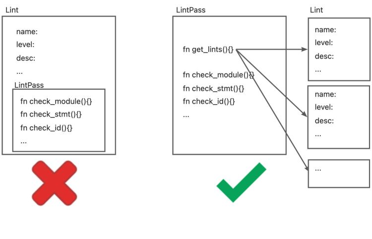

# Lint 与 LintPass

## 背景

### Rustc

Rustc 是 Rust Compiler 的简称，即 Rust 编程语言的编译器。Rust 的编译器是自举的，即 Rustc 由 Rust 语言编写而成，可以通过旧版本编译出新版本。因此，Rustc 可以说是用 Rust 语言编写编译器的最佳实践。

### Lint 工具

Lint 是代码静态分析工具的一种，最早是来源于 C 语言。Lint 工具通常会检查代码中潜在的问题和错误，包括（但不限于）编程风格（缩进、空行、空格）、代码质量（定义未使用的变量、文档缺失）以及错误代码（除0错误、重复定义、循环引用）等问题。通常来说，Lint 工具除了标识错误外，还会带有一定的 fix/refactor suggest 和 auto-fix 的能力。在工程中引入 Lint 工具可以有效的减少错误，提高整体的工程质量。此外，对一种编程语言来说，Lint 工具通常也是其他工具研发的前置条件，例如 IDE 插件的错误提示，CI 的 Pipeline 检测等。

## Lint vs. LintPass

### 概念与关系

Rustc 中关于 Lint 最主要的结构有两个， `Lint` 和 `LintPass`。首先需要区分 Lint 和 LintPass 的概念。Rustc 的很多文档中都将它们统称为 `Lint`，这很容易造成混淆。关于这两者之间的区别，rustc-dev-guide 给出的解释是：

> Lint declarations don't carry any "state" - they are merely global identifiers and descriptions of lints. We assert at runtime that they are not registered twice (by lint name).
Lint passes are the meat of any lint.

从定义方面， `Lint` 是对所定义的 lint 检查的静态描述，例如 name, level, description, code 等属性，与检查时的状态无关，Rustc 用 `Lint` 的定义做唯一性的检查。而 `LintPass` 是 `Lint` 的具体实现，是在检查时调用的 `check_*` 方法。
在具体的代码实现方法， `Lint`定义为一个 Struct，所有 lint 的定义都是此类型的一个实例/对象。而 `LintPass` 则对应为一个 trait。trait 类似于 java/c++ 中的接口，每一个 lintpass 的定义都需要实现该接口中定义的方法。

```rust
/// Specification of a single lint.
#[derive(Copy, Clone, Debug)]
pub struct Lint {
    pub name: &'static str,
    /// Default level for the lint.
    pub default_level: Level,
    /// Description of the lint or the issue it detects.
    ///
    /// e.g., "imports that are never used"
    pub desc: &'static str,
    ...
}

pub trait LintPass {
    fn name(&self) -> &'static str;
}
```

需要注意的是，尽管刚刚的描述中说到`trait` 类似于接口而 `Lint` 是一个 struct，但 `Lint` 和 `LintPass` 之间并不是 OO 中一个“类”和它的“方法”的关系。而是在声明 `LintPass` 会生成一个实现了该 trait 的同名的 struct，该 struct 中的 `get_lints()` 方法会生成对应的 `Lint` 定义。



这与 rustc-dev-guide 的描述也保持了一致:

> A lint might not have any lint pass that emits it, it could have many, or just one -- the compiler doesn't track whether a pass is in any way associated with a particular lint, and frequently lints are emitted as part of other work (e.g., type checking, etc.).

### Lint 与 LintPass 的宏定义

Rustc 为 Lint 和 LintPass 都提供了用于定义其结构的宏。
定义 Lint 的宏`declare_lint` 比较简单，可以在`rustc_lint_defs::lib.rs`中找到。`declare_lint` 宏解析输入参数，并生成名称为 `$NAME` 的 Lint struct。

```rust
#[macro_export]
macro_rules! declare_lint {
    ($(#[$attr:meta])* $vis: vis $NAME: ident, $Level: ident, $desc: expr) => (
        $crate::declare_lint!(
            $(#[$attr])* $vis $NAME, $Level, $desc,
        );
    );
    ($(#[$attr:meta])* $vis: vis $NAME: ident, $Level: ident, $desc: expr,
     $(@feature_gate = $gate:expr;)?
     $(@future_incompatible = FutureIncompatibleInfo { $($field:ident : $val:expr),* $(,)*  }; )?
     $($v:ident),*) => (
        $(#[$attr])*
        $vis static $NAME: &$crate::Lint = &$crate::Lint {
            name: stringify!($NAME),
            default_level: $crate::$Level,
            desc: $desc,
            edition_lint_opts: None,
            is_plugin: false,
            $($v: true,)*
            $(feature_gate: Some($gate),)*
            $(future_incompatible: Some($crate::FutureIncompatibleInfo {
                $($field: $val,)*
                ..$crate::FutureIncompatibleInfo::default_fields_for_macro()
            }),)*
            ..$crate::Lint::default_fields_for_macro()
        };
    );
    ($(#[$attr:meta])* $vis: vis $NAME: ident, $Level: ident, $desc: expr,
     $lint_edition: expr => $edition_level: ident
    ) => (
        $(#[$attr])*
        $vis static $NAME: &$crate::Lint = &$crate::Lint {
            name: stringify!($NAME),
            default_level: $crate::$Level,
            desc: $desc,
            edition_lint_opts: Some(($lint_edition, $crate::Level::$edition_level)),
            report_in_external_macro: false,
            is_plugin: false,
        };
    );
}
```

LintPass 的定义涉及到两个宏：

- declare_lint_pass：生成一个名为`$name` 的 struct，并且调用 `impl_lint_pass` 宏。

```rust
macro_rules! declare_lint_pass {
    ($(#[$m:meta])* $name:ident => [$($lint:expr),* $(,)?]) => {
        $(#[$m])* #[derive(Copy, Clone)] pub struct $name;
        $crate::impl_lint_pass!($name => [$($lint),*]);
    };
}
```

- impl_lint_pass：为生成的 `LintPass` 结构实现`fn name()`和 `fn get_lints()` 方法。

```rust
macro_rules! impl_lint_pass {
    ($ty:ty => [$($lint:expr),* $(,)?]) => {
        impl $crate::LintPass for $ty {
            fn name(&self) -> &'static str { stringify!($ty) }
        }
        impl $ty {
            pub fn get_lints() -> $crate::LintArray { $crate::lint_array!($($lint),*) }
        }
    };
}
```

### EarlyLintPass 与 LateLintPass

前面关于 `LintPass` 的宏之中，只定义了`fn name()`和 `fn get_lints()` 方法，但并没有定义用于检查的 `check_*` 函数。这是因为 Rustc 中将 `LintPass` 分为了更为具体的两类：`EarlyLintPass`和`LateLintPass`。其主要区别在于检查的元素是否带有类型信息，即在类型检查之前还是之后执行。例如， `WhileTrue` 检查代码中的 `while true{...}` 并提示用户使用 `loop{...}` 去代替。这项检查不需要任何的类型信息，因此被定义为一个  `EarlyLint`(代码中 `impl EarlyLintPass for WhileTrue`。

```rust
declare_lint! {
    WHILE_TRUE,
    Warn,
    "suggest using `loop { }` instead of `while true { }`"
}

declare_lint_pass!(WhileTrue => [WHILE_TRUE]);

impl EarlyLintPass for WhileTrue {
    fn check_expr(&mut self, cx: &EarlyContext<'_>, e: &ast::Expr) {
        ...
    }
}
```

Rustc 中用了3个宏去定义 `EarlyLintPass`：

- early_lint_methods：early_lint_methods 中定义了 `EarlyLintPass` 中需要实现的 `check_*`函数，并且将这些函数以及接收的参数 `$args`传递给下一个宏。

```rust
macro_rules! early_lint_methods {
    ($macro:path, $args:tt) => (
        $macro!($args, [
            fn check_param(a: &ast::Param);
            fn check_ident(a: &ast::Ident);
            fn check_crate(a: &ast::Crate);
            fn check_crate_post(a: &ast::Crate);
            ...
        ]);
    )
}
```

- declare_early_lint_pass：生成trait `EarlyLintPass` 并调用宏 `expand_early_lint_pass_methods`。

```rust
macro_rules! declare_early_lint_pass {
    ([], [$($methods:tt)*]) => (
        pub trait EarlyLintPass: LintPass {
            expand_early_lint_pass_methods!(&EarlyContext<'_>, [$($methods)*]);
        }
    )
}
```

- expand_early_lint_pass_methods：为`check_*`方法提供默认实现，即空检查。

```rust
macro_rules! expand_early_lint_pass_methods {
    ($context:ty, [$($(#[$attr:meta])* fn $name:ident($($param:ident: $arg:ty),*);)*]) => (
        $(#[inline(always)] fn $name(&mut self, _: $context, $(_: $arg),*) {})*
    )
}
```

这样的设计好处有以下几点：

1. 因为 LintPass 是一个 trait，每一个 LintPass 的定义都需要实现其内部定义的所有方法。但 early lint 和 late lint 发生在编译的不同阶段，函数入参也不一致（AST 和 HIR）。因此，LintPass 的定义只包含了 `fn name()` 和 `fn get_lints()` 这两个通用的方法。而执行检查函数则定义在了更为具体的 `EarlyLintPass` 和 `LateLintPass` 中。
1. 同样的，对于 `EarlyLintPass`， 每一个 lintpass 的定义都必须实现其中的所有方法。但并非每一个 lintpass 都需要检查 AST 的所有节点。 `expand_early_lint_pass_methods` 为其内部方法提供了默认实现。这样在定义具体的 lintpass 时，只需要关注和实现其相关的检查函数即可。例如，对于 `WhileTrue` 的定义，因为 `while true { }`这样的写法只会出现在 `ast::Expr` 节点中，因此只需要实现 `check_expr` 函数即可。在其他任何节点调用 `WhileTrue` 的检查函数，如在检查 AST 上的标识符节点时，调用 `WhileTrue.check_ident()`，则根据宏 `expand_early_lint_pass_methods` 中的定义执行一个空函数。

### pass 的含义

在 Rustc 中，除了 `Lint` 和 `LintPass` 外，还有一些 `*Pass` 的命名，如 `Mir` 和 `MirPass`、`rustc_passes` 包等。编译原理龙书中对Pass有对应的解释：

> 1.2.8 将多个步骤组合成趟
前面关于步骤的讨论讲的是一个编译器的逻辑组织方式。在一个特定的实现中，多个步骤的活动可以被组合成一趟（pass）。每趟读入一个输入文件并产生一个输出文件。

在声明 `LintPass` 的宏 `declare_lint_pass` 中，其第二个参数为一个列表，表示一个 lintpass 可以生成多个 lint。Rustc 中还有一些 CombinedLintPass 中也是将所有 builtin 的 lint 汇总到一个 lintpass 中。这与龙书中“趟”的定义基本一致:`LintPass` 可以组合多个 `Lint` 的检查，每个 LintPass 读取一个 AST 并产生对应的结果。

## Lint 的简单实现

在 LintPass 的定义中，给每一个 lintpass 的所有 `check_*` 方法都提供了一个默认实现。到这里为止，基本上已经可以实现 Lint 检查的功能。

```rust
struct Linter { }
impl ast_visit::Visitor for Linter {
    fn visit_crate(a: ast:crate){
        for lintpass in lintpasses{
            lintpass.check_crate(a)
        }
        walk_crate();
    }
    fn visit_stmt(a: ast:stmt){
        for lintpass in lintpasses{
            lintpass.check_stmt(a)
        }
        walk_stmt();
    }
    ...
}

let linter = Linter::new();

for c in crates{
    linter.visit_crate(c);
}
```

`Visitor` 是遍历 AST 的工具，在这里为 Linter 实现其中的 `visit_*` 方法，在遍历时调用所有 lintpass 的 `check_*` 函数。`walk_*` 会继续调用其他的 `visit_*` 函数，遍历其中的子节点。因此，对于每一个 crate， 只需要调用 `visit_crate()` 函数就可以遍历 AST 并完成检查。

## 总结

本文简单介绍了 Rustc 源码中关于 Lint 的几个重要结构。并以 `WhileTrue` 为例说明了 Rustc 如何中定义和实现一个 `Lint`，最后基于这些结构，提供了一个简易的 Lint 检查的实现方式。希望能够对理解 Rustc 及 Lint 有所帮助，如有错误，欢迎指正。KCL 的 Lint 工具也参考了其中部分设计， 由文末简易的 Linter 结构改进而成。篇幅限制，将后续的文章将继续介绍 Rustc 中 Lint 在编译过程中的注册和执行过程，如何继续优化上述 `Linter` 的实现，以及 KCL Lint 的设计和实践，期待继续关注。

## Ref

- KusionStack: <https://github.com/KusionStack>
- Rustc: <https://github.com/rust-lang/rust>
- rustc-dev-guide: <https://rustc-dev-guide.rust-lang.org/>
- Rust Visitor: <https://doc.rust-lang.org/nightly/nightly-rustc/rustc_ast/visit/index.html>
- Rust Clippy: <https://github.com/rust-lang/rust-clippy>
