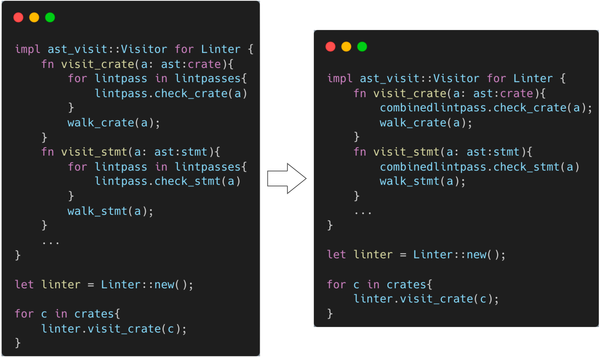
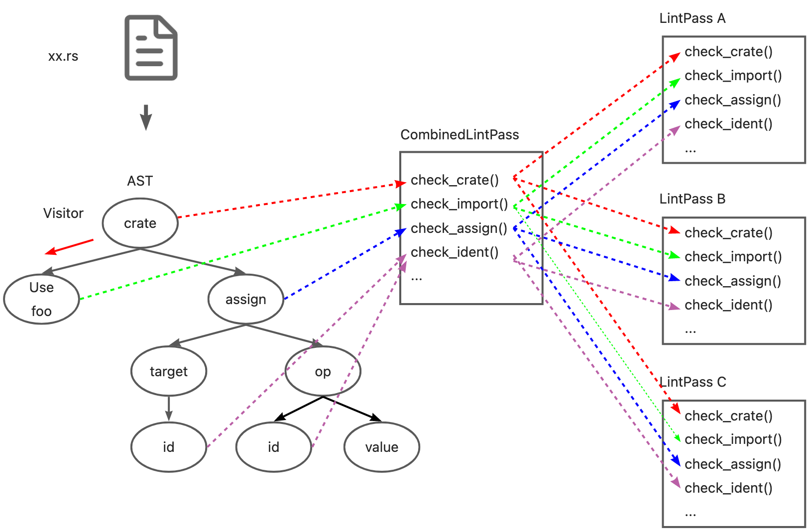
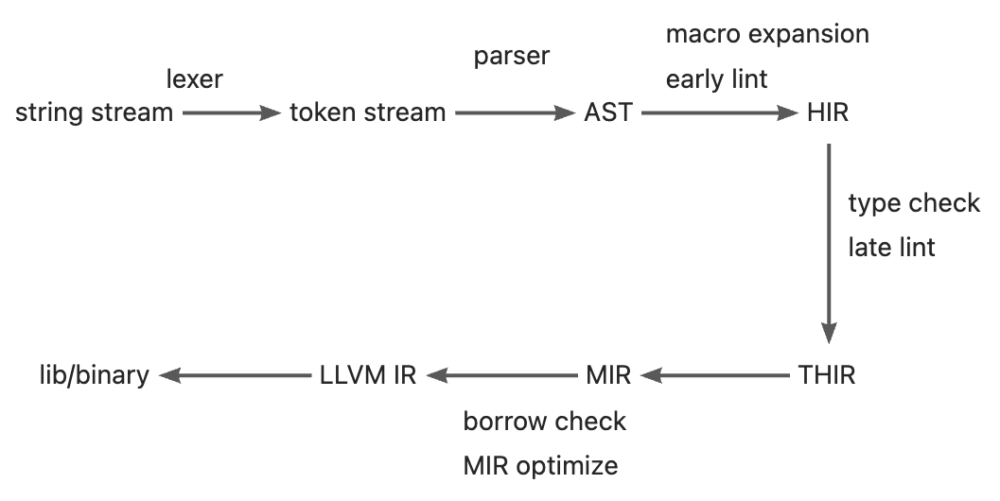
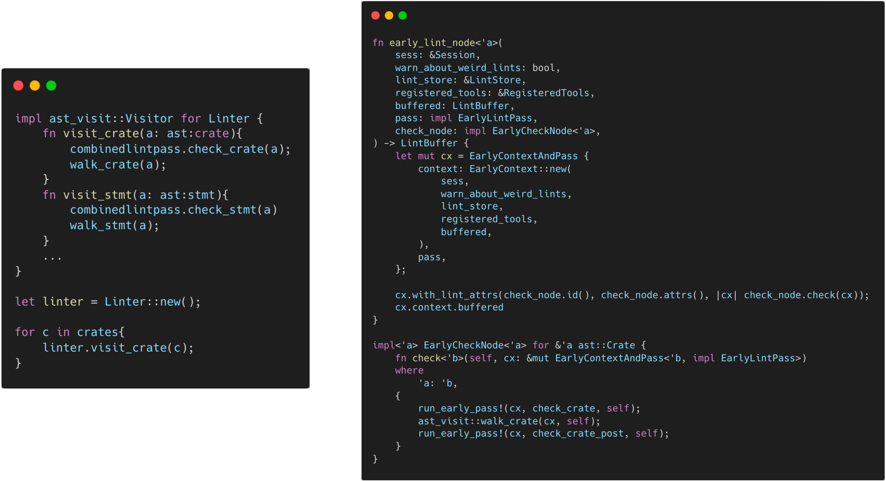

# Lint

## Background

Lint is a kind of static analysis tool, which originated from the C language. Lint tools usually check potential problems and errors in code, including (but not limited to) programming style (indentation, blank lines, spaces), code quality (unused variables, missing documents), and error codes (division by zero, duplicate definitions, circular references). Generally speaking, in addition to identifying errors, lint tools also have some fix/refactor suggest and auto fix capabilities. Using lint tools in the project can effectively reduce errors and improve the project quality. In addition, for a programming language, the lint tool is usually a prerequisite for the development of other tools, such as the error prompt of IDE plug-ins(e.g., LSP) and the pipeline detection of CI.

## Lint vs. LintPass

### Concepts

There are two main structures about lint in Rustc, `Lint` and `LintPass`. First, we need to distinguish the concepts of Lint and LintPass. In many documents of Rustc, they are both referred to as 'Lint', which is easy to confuse. The difference between them is explained by rustc-dev-guide as follows:

> Lint declarations don't carry any "state" - they are merely global identifiers and descriptions of lints. We assert at runtime that they are not registered twice (by lint name).
Lint passes are the meat of any lint.

In terms of definition, `Lint` is just a description of the lint check defined, such as name, level, description, code and other attributes. It doesn't carry any state of checking. Rustc checks the uniqueness of registered lints at runtime. `LintPass` is an implementation of `lint`, which contains the `check_*` methods that are called when checking.

In terms of code implementation, `Lint` is defined as a struct in Rust, and all lint definitions are an instance of this struct. And `LintPass` is a trait. The `Trait` is similar to the interface in Java/C++. Every definition of lintpass needs to implement the methods defined in the interface.

```rust
/// Specification of a single lint.
#[derive(Copy, Clone, Debug)]
pub struct Lint {
    pub name: &'static str,
    /// Default level for the lint.
    pub default_level: Level,
    /// Description of the lint or the issue it detects.
    ///
    /// e.g., "imports that are never used"
    pub desc: &'static str,
    ...
}

pub trait LintPass {
    fn name(&self) -> &'static str;
}
```

It should be noted that although we just said that `trait` is similar to an interface and `Lint` is a struct, the relationship between `Lint` and `LintPass` is not a "class" and its "methods" in OO. Instead, declaring `LintPass` will generate a struct with the same name, this struct implements the trait, and the `get_lints()` method in this struct will generate the corresponding `Lint` definition.


This is also consistent with the description of the rustc-dev-guide:

> A lint might not have any lint pass that emits it, it could have many, or just one -- the compiler doesn't track whether a pass is in any way associated with a particular lint, and frequently lints are emitted as part of other work (e.g., type checking, etc.).

### Definition of Lint and LintPass

Rustc provides macros for both Lint and LintPass to define their structure.
The macro `declare_lint` that defines Lint is simple, it can be found in `rustc_lint_defs::lib.rs`. The `declare_lint` macro parses the input arguments and produces a Lint struct named `$NAME`.

```rust
#[macro_export]
macro_rules! declare_lint {
    ($(#[$attr:meta])* $vis: vis $NAME: ident, $Level: ident, $desc: expr) => (
        $crate::declare_lint!(
            $(#[$attr])* $vis $NAME, $Level, $desc,
        );
    );
    ($(#[$attr:meta])* $vis: vis $NAME: ident, $Level: ident, $desc: expr,
     $(@feature_gate = $gate:expr;)?
     $(@future_incompatible = FutureIncompatibleInfo { $($field:ident : $val:expr),* $(,)*  }; )?
     $($v:ident),*) => (
        $(#[$attr])*
        $vis static $NAME: &$crate::Lint = &$crate::Lint {
            name: stringify!($NAME),
            default_level: $crate::$Level,
            desc: $desc,
            edition_lint_opts: None,
            is_plugin: false,
            $($v: true,)*
            $(feature_gate: Some($gate),)*
            $(future_incompatible: Some($crate::FutureIncompatibleInfo {
                $($field: $val,)*
                ..$crate::FutureIncompatibleInfo::default_fields_for_macro()
            }),)*
            ..$crate::Lint::default_fields_for_macro()
        };
    );
    ($(#[$attr:meta])* $vis: vis $NAME: ident, $Level: ident, $desc: expr,
     $lint_edition: expr => $edition_level: ident
    ) => (
        $(#[$attr])*
        $vis static $NAME: &$crate::Lint = &$crate::Lint {
            name: stringify!($NAME),
            default_level: $crate::$Level,
            desc: $desc,
            edition_lint_opts: Some(($lint_edition, $crate::Level::$edition_level)),
            report_in_external_macro: false,
            is_plugin: false,
        };
    );
}
```

The definition of LintPass involves two macros:

- declare_lint_pass: Generate a struct named `$name` and call the macro `impl_lint_pass`.

```rust
macro_rules! declare_lint_pass {
    ($(#[$m:meta])* $name:ident => [$($lint:expr),* $(,)?]) => {
        $(#[$m])* #[derive(Copy, Clone)] pub struct $name;
        $crate::impl_lint_pass!($name => [$($lint),*]);
    };
}
```

- impl_lint_pass: Implements the `fn name()` and `fn get_lints()` methods for the generated `LintPass` structure.

```rust
macro_rules! impl_lint_pass {
    ($ty:ty => [$($lint:expr),* $(,)?]) => {
        impl $crate::LintPass for $ty {
            fn name(&self) -> &'static str { stringify!($ty) }
        }
        impl $ty {
            pub fn get_lints() -> $crate::LintArray { $crate::lint_array!($($lint),*) }
        }
    };
}
```

### EarlyLintPass and LateLintPass

In the macro definition of `LintPass`, only the `fn name()` and `fn get_lints()` methods are defined, but the `check_*` functions for checking are not provided. This is because Rustc divides `LintPass` into two more specific categories: `EarlyLintPass` and `LateLintPass`. The main difference is whether the checked element has type information, i.e. is performed before or after the type checking. For example, `WhileTrue` checks for `while true{...}` in the code and prompts the user to use `loop{...}` instead it. This check does not require any type information and is therefore defined as an `EarlyLint` (`impl EarlyLintPass for WhileTrue` in the code.

```rust
declare_lint! {
    WHILE_TRUE,
    Warn,
    "suggest using `loop { }` instead of `while true { }`"
}

declare_lint_pass!(WhileTrue => [WHILE_TRUE]);

impl EarlyLintPass for WhileTrue {
    fn check_expr(&mut self, cx: &EarlyContext<'_>, e: &ast::Expr) {
        ...
    }
}
```

Rustc uses 3 macros to define `EarlyLintPass`:

- early_lint_methods: early_lint_methods defines the `check_*` functions that need to be implemented in `EarlyLintPass`, and passes these functions and the received parameters `$args` to the next macro.

```rust
macro_rules! early_lint_methods {
    ($macro:path, $args:tt) => (
        $macro!($args, [
            fn check_param(a: &ast::Param);
            fn check_ident(a: &ast::Ident);
            fn check_crate(a: &ast::Crate);
            fn check_crate_post(a: &ast::Crate);
            ...
        ]);
    )
}
```

- declare_early_lint_pass: Generate trait `EarlyLintPass` and call macro `expand_early_lint_pass_methods`.

```rust
macro_rules! declare_early_lint_pass {
    ([], [$($methods:tt)*]) => (
        pub trait EarlyLintPass: LintPass {
            expand_early_lint_pass_methods!(&EarlyContext<'_>, [$($methods)*]);
        }
    )
}
```

- expand_early_lint_pass_methods: Provides default implementations for `check_*` methods: nothing to do(`{}` in code).

```rust
macro_rules! expand_early_lint_pass_methods {
    ($context:ty, [$($(#[$attr:meta])* fn $name:ident($($param:ident: $arg:ty),*);)*]) => (
        $(#[inline(always)] fn $name(&mut self, _: $context, $(_: $arg),*) {})*
    )
}
```

The benefits are as follows:

1. Because `LintPass` is a trait, every definition of `LintPass` needs to implement all of its methods. But early lint and late lint occur at different stages of compilation, and the input parameters are also different (AST and HIR). Therefore, the definition of LintPass contains only two general methods `fn name()` and `fn get_lints()`. The check methods are defined in the more specific `EarlyLintPass` and `LateLintPass`.
2. Likewise, for `EarlyLintPass`, every definition of lintpass must implement all of its methods. But not every lintpass needs to check all nodes of the AST. `expand_early_lint_pass_methods` provides default implementations for its methods. In this way, when defining a specific lintpass, you only need to pay attention to implementing its related check methods. For example, for the definition of `WhileTrue`, since `while true { }` only appears in the `ast::Expr` node, it only needs to implement the `check_expr` function. Calling the `WhileTrue` check function at any other node, such as call `WhileTrue.check_ident()` when checking an identifier node on the AST, will only execute an empty method as defined in the macro `expand_early_lint_pass_methods`.

### Meaning of pass

In Rustc, in addition to `Lint` and `LintPass`, there are some `*Pass` naming, such as `Mir` and `MirPass`, the `rustc_passes` package, etc. The **Compilers, Principles, Techniques, & Tools** has a corresponding explanation for Pass:

> 1.2.8 Combine multiple steps into a pass
The previous discussion of steps was about the logical organization of a compiler. In a particular implementation, the activities of multiple steps can be combined into a pass. Each pass reads in an input file and produces an output file.

In the macro `declare_lint_pass` that declares `LintPass`, its second parameter is a list, indicating that a lintpass can generate multiple lints. There are also some CombinedLintPass in Rustc that also aggregates all built-in lints into one lintpass. This is basically the same as the definition of "pass" in the Dragon Book: `LintPass` can combine multiple `Lint` checks, each LintPass reads an AST/HIR and produces a corresponding result.

## Simple design of Linter

In the definition of LintPass, a default implementation is provided for all `check_*` methods of each lintpass. So far, we can implement a simple Linter tool：

```rust
struct Linter { }
impl ast_visit::Visitor for Linter {
    fn visit_crate(a: ast:crate){
        for lintpass in lintpasses{
            lintpass.check_crate(a)
        }
        walk_crate();
    }
    fn visit_stmt(a: ast:stmt){
        for lintpass in lintpasses{
            lintpass.check_stmt(a)
        }
        walk_stmt();
    }
    ...
}

let linter = Linter::new();

for c in crates{
    linter.visit_crate(c);
}
```

`Visitor` is a tool for traversing the AST. Here, the `visit_*` methods are implemented for Linter, and all lintpass `check_*` methods are called during traversal. `walk_*` will continue to call other `visit_*` methods to traverse its child nodes. So, for each crate, just call the `visit_crate()` function to traverse the AST and complete the lint check.

## CombinedLintpass

However, Rustc and Clippy provide more than 550 lint definitions. Considering the performance, it is obviously inappropriate to define a large number of lintpasses, register and call them separately. Rustc provides a better solution: since multiple lints can be organized into one lintpass, multiple lintpasses can also be combined into a CombinedLintPass.
> [Compiler lint passes are combined into one pass](https://rustc-dev-guide.rust-lang.org/diagnostics/lintstore.html#compiler-lint-passes-are-combined-into-one-pass)
> Within the compiler, for performance reasons, we usually do not register dozens of lint passes. Instead, we have a single lint pass of each variety (e.g., BuiltinCombinedModuleLateLintPass) which will internally call all of the individual lint passes; this is because then we get the benefits of static over dynamic dispatch for each of the (often empty) trait methods.
> Ideally, we'd not have to do this, since it adds to the complexity of understanding the code. However, with the current type-erased lint store approach, it is beneficial to do so for performance reasons.

### BuiltinCombinedEarlyLintPass

Combinedlintpass is also divided into early and late. Take builtin's early lint as an example, `rustc_ lint::src::lib.rs` defines a `BuiltinCombinedEarlyLintPass` structure for these lintpasses.

```rust
early_lint_passes!(declare_combined_early_pass, [BuiltinCombinedEarlyLintPass]);
```

Although this definition seems to have only one line, it summarizes 14 `LintPass` through the expansion of several macros, and each `LintPass` provides more than 50 'checks_*` method.  Let's explain these macros one by one.

#### Define BuiltinCombinedEarlyLintPass by macros

- early_lint_passes

```rust
macro_rules! early_lint_passes {
    ($macro:path, $args:tt) => {
        $macro!(
            $args,
            [
                UnusedParens: UnusedParens,
                UnusedBraces: UnusedBraces,
                UnusedImportBraces: UnusedImportBraces,
                UnsafeCode: UnsafeCode,
                AnonymousParameters: AnonymousParameters,
                EllipsisInclusiveRangePatterns: EllipsisInclusiveRangePatterns::default(),
                NonCamelCaseTypes: NonCamelCaseTypes,
                DeprecatedAttr: DeprecatedAttr::new(),
                WhileTrue: WhileTrue,
                NonAsciiIdents: NonAsciiIdents,
                HiddenUnicodeCodepoints: HiddenUnicodeCodepoints,
                IncompleteFeatures: IncompleteFeatures,
                RedundantSemicolons: RedundantSemicolons,
                UnusedDocComment: UnusedDocComment,
            ]
        );
    };
}
```

The first is the macro `early_ lint_ passes`. The main function of this macro is to define all early lintpass. The left side of `:`is the identifier of lintpass, and the right side of `:` is the constructor of lintpass. Therefore, `ellipseinclusiverangepatterns::default()` and `deprecedattr::new()` are differnet from others. `early_ lint_ passes` passes the defined early lintpass to the next macro together with the second parameter.

Through this macro, the previous definition of `BuiltinCombinedEarlyLintPass` is expanded to:

```rust
declare_combined_early_pass!([BuiltinCombinedEarlyLintPass], [
                UnusedParens: UnusedParens,
                UnusedBraces: UnusedBraces,
                UnusedImportBraces: UnusedImportBraces,
                UnsafeCode: UnsafeCode,
                AnonymousParameters: AnonymousParameters,
                EllipsisInclusiveRangePatterns: EllipsisInclusiveRangePatterns::default(),
                NonCamelCaseTypes: NonCamelCaseTypes,
                DeprecatedAttr: DeprecatedAttr::new(),
                WhileTrue: WhileTrue,
                NonAsciiIdents: NonAsciiIdents,
                HiddenUnicodeCodepoints: HiddenUnicodeCodepoints,
                IncompleteFeatures: IncompleteFeatures,
                RedundantSemicolons: RedundantSemicolons,
                UnusedDocComment: UnusedDocComment,
            ])
```

- declare_combined_early_pass

```rust
macro_rules! declare_combined_early_pass {
    ([$name:ident], $passes:tt) => (
        early_lint_methods!(declare_combined_early_lint_pass, [pub $name, $passes]);
    )
}
```

Macro `declare_combined_early_pass` receives the name (BuiltinCombinedEarlyLintPass) and passes from macro `early_lint_passes`, and continues to pass them to macro `early_lint_methods`.

Through this macro, the definition of `BuiltinCombinedEarlyLintPass` expand to:

```rust
early_lint_methods!(declare_combined_early_lint_pass, 
                    [pub BuiltinCombinedEarlyLintPass, 
                      [
                            UnusedParens: UnusedParens,
                            UnusedBraces: UnusedBraces,
                            UnusedImportBraces: UnusedImportBraces,
                            UnsafeCode: UnsafeCode,
                            AnonymousParameters: AnonymousParameters,
                            EllipsisInclusiveRangePatterns: EllipsisInclusiveRangePatterns::default(),
                            NonCamelCaseTypes: NonCamelCaseTypes,
                            DeprecatedAttr: DeprecatedAttr::new(),
                            WhileTrue: WhileTrue,
                            NonAsciiIdents: NonAsciiIdents,
                            HiddenUnicodeCodepoints: HiddenUnicodeCodepoints,
                            IncompleteFeatures: IncompleteFeatures,
                            RedundantSemicolons: RedundantSemicolons,
                            UnusedDocComment: UnusedDocComment,
               ]
                    ]);
```

- early_lint_methods

```rust
macro_rules! early_lint_methods {
    ($macro:path, $args:tt) => (
        $macro!($args, [
            fn check_param(a: &ast::Param);
            fn check_ident(a: &ast::Ident);
            fn check_crate(a: &ast::Crate);
            fn check_crate_post(a: &ast::Crate);
            ...
        ]);
    )
}
```

Macro `early_lint_methods` has been explained earlier. It defines the methods `check_*` which need to be implemented in the `EarlyLintPass`, and pass these methods and the parameter `$args` to the next macro. Because `BuiltinCombinedEarlyLintPass` is also a kind of early lint, it is also necessary to implement these methods.

Through this macro, the definition of 'BuiltinCombinedEarlyLintPass' expand to:

```rust
declare_combined_early_lint_pass!(
    [pub BuiltinCombinedEarlyLintPass, 
        [
            UnusedParens: UnusedParens,
            UnusedBraces: UnusedBraces,
            UnusedImportBraces: UnusedImportBraces,
            UnsafeCode: UnsafeCode,
            AnonymousParameters: AnonymousParameters,
            EllipsisInclusiveRangePatterns: EllipsisInclusiveRangePatterns::default(),
            NonCamelCaseTypes: NonCamelCaseTypes,
            DeprecatedAttr: DeprecatedAttr::new(),
            WhileTrue: WhileTrue,
            NonAsciiIdents: NonAsciiIdents,
            HiddenUnicodeCodepoints: HiddenUnicodeCodepoints,
            IncompleteFeatures: IncompleteFeatures,
            RedundantSemicolons: RedundantSemicolons,
            UnusedDocComment: UnusedDocComment,
        ]
    ],
    [
        fn check_param(a: &ast::Param);
        fn check_ident(a: &ast::Ident);
        fn check_crate(a: &ast::Crate);
        fn check_crate_post(a: &ast::Crate);
        ...
    ]
)
```

- declare_combined_early_lint_pass

```rust
macro_rules! declare_combined_early_lint_pass {
    ([$v:vis $name:ident, [$($passes:ident: $constructor:expr,)*]], $methods:tt) => (
        #[allow(non_snake_case)]
        $v struct $name {
            $($passes: $passes,)*
        }
        impl $name {
            $v fn new() -> Self {
                Self {
                    $($passes: $constructor,)*
                }
            }
            $v fn get_lints() -> LintArray {
                let mut lints = Vec::new();
                $(lints.extend_from_slice(&$passes::get_lints());)*
                lints
            }
        }
        impl EarlyLintPass for $name {
            expand_combined_early_lint_pass_methods!([$($passes),*], $methods);
        }
        #[allow(rustc::lint_pass_impl_without_macro)]
        impl LintPass for $name {
            fn name(&self) -> &'static str {
                panic!()
            }
        }
    )
}
```

Macro `declare_combined_early_lint_pass` is the main structure for generating `BuiltinCombinedEarlyLintPass`. It does the following works:

- Generate a struct named `BuiltinCombinedEarlyLintPass`, whose fields is the identifier provided by macro `early_lint_passes`.
- Implement methods `fn new()` `fn name()` and `fn get_lints()`. The method `new()` uses constructor of lintpass provided by marco `early_lint_passes`.
- Call the marco `expand_combined_early_lint_pass_methods` to implememt self `check_*` methods.

Through this macro, the definition of `BuiltinCombinedEarlyLintPass` is changed to:

```rust
pub struct BuiltinCombinedEarlyLintPass {
            UnusedParens: UnusedParens,
            UnusedBraces: UnusedBraces,
            UnusedImportBraces: UnusedImportBraces,
            UnsafeCode: UnsafeCode,
            AnonymousParameters: AnonymousParameters,
            EllipsisInclusiveRangePatterns: EllipsisInclusiveRangePatterns,
            NonCamelCaseTypes: NonCamelCaseTypes,
            DeprecatedAttr: DeprecatedAttr,
            WhileTrue: WhileTrue,
            NonAsciiIdents: NonAsciiIdents,
            HiddenUnicodeCodepoints: HiddenUnicodeCodepoints,
            IncompleteFeatures: IncompleteFeatures,
            RedundantSemicolons: RedundantSemicolons,
            UnusedDocComment: UnusedDocComment,
}
impl BuiltinCombinedEarlyLintPass {
    pub fn new() -> Self {
        Self {
            UnusedParens: UnusedParens,
            UnusedBraces: UnusedBraces,
            UnusedImportBraces: UnusedImportBraces,
            UnsafeCode: UnsafeCode,
            AnonymousParameters: AnonymousParameters,
            EllipsisInclusiveRangePatterns: EllipsisInclusiveRangePatterns::default(),
            NonCamelCaseTypes: NonCamelCaseTypes,
            DeprecatedAttr: DeprecatedAttr::new(),
            WhileTrue: WhileTrue,
            NonAsciiIdents: NonAsciiIdents,
            HiddenUnicodeCodepoints: HiddenUnicodeCodepoints,
            IncompleteFeatures: IncompleteFeatures,
            RedundantSemicolons: RedundantSemicolons,
            UnusedDocComment: UnusedDocComment,
        }
    }
    pub fn get_lints() -> LintArray {
        let mut lints = Vec::new();
        lints.extend_from_slice(&UnusedParens::get_lints());
        lints.extend_from_slice(&UnusedBraces::get_lints());
        lints.extend_from_slice(&UnusedImportBraces::get_lints());
        lints.extend_from_slice(&UnsafeCode::get_lints());
        lints.extend_from_slice(&AnonymousParameters::get_lints());
        lints.extend_from_slice(&EllipsisInclusiveRangePatterns::get_lints());
        lints.extend_from_slice(&NonCamelCaseTypes::get_lints());
        lints.extend_from_slice(&DeprecatedAttr::get_lints());
        lints.extend_from_slice(&WhileTrue::get_lints());
        lints.extend_from_slice(&NonAsciiIdents::get_lints());
        lints.extend_from_slice(&HiddenUnicodeCodepoints::get_lints());
        lints.extend_from_slice(&IncompleteFeatures::get_lints());
        lints.extend_from_slice(&RedundantSemicolons::get_lints());
        lints.extend_from_slice(&UnusedDocComment::get_lints());
        
        lints
    }
}
impl EarlyLintPass for BuiltinCombinedEarlyLintPass {
    expand_combined_early_lint_pass_methods!([$($passes),*], $methods);
}
#[allow(rustc::lint_pass_impl_without_macro)]
impl LintPass for BuiltinCombinedEarlyLintPass {
    fn name(&self) -> &'static str {
        panic!()
    }
}
```

- expand_combined_early_lint_pass_methods

```rust
macro_rules! expand_combined_early_lint_pass_methods {
    ($passes:tt, [$($(#[$attr:meta])* fn $name:ident($($param:ident: $arg:ty),*);)*]) => (
        $(fn $name(&mut self, context: &EarlyContext<'_>, $($param: $arg),*) {
            expand_combined_early_lint_pass_method!($passes, self, $name, (context, $($param),*));
        })*
    )
}
```

Marco `expand_combined_early_lint_pass_methods` explands all methods defined in `early_lint_methods`.

Through this macro, the definition of `BuiltinCombinedEarlyLintPass` is changed to(ignore other definitions):

```rust
impl EarlyLintPass for BuiltinCombinedEarlyLintPass {
    fn check_param(&mut self, context: &EarlyContext<'_>, a: &ast::Param) {
        expand_combined_early_lint_pass_method!($passes, self, $name, (context, $($param),*));
    }
    fn check_ident(&mut self, context: &EarlyContext<'_>, a: &ast::Ident) {
        expand_combined_early_lint_pass_method!($passes, self, $name, (context, $($param),*));
    }
    fn check_crate(&mut self, context: &EarlyContext<'_>, a: &ast::Crate) {
        expand_combined_early_lint_pass_method!($passes, self, $name, (context, $($param),*));
    }
    ...
    
}
```

- expand_combined_early_lint_pass_method

```rust
macro_rules! expand_combined_early_lint_pass_method {
    ([$($passes:ident),*], $self: ident, $name: ident, $params:tt) => ({
        $($self.$passes.$name $params;)*
    })
}
```

Macro `expand_combined_early_lint_pass_method` call `check_*` methods defined in each `LintPass`.

Through this macro, the definition of `BuiltinCombinedEarlyLintPass` is changed to(ignore other definitions):

```rust
impl EarlyLintPass for BuiltinCombinedEarlyLintPass {
    fn check_param(&mut self, context: &EarlyContext<'_>, a: &ast::Param) {
        self.UnusedParens.check_param(context, a);
        self.UnusedBraces.check_param(context, a);
        self.UnusedImportBraces.check_param(context, a);
        ...
    }
    fn check_ident(&mut self, context: &EarlyContext<'_>, a: &ast::Ident) {
        self.UnusedParens.check_ident(context, a);
        self.UnusedBraces.check_ident(context, a);
        self.UnusedImportBraces.check_ident(context, a);
        ...
    }
    fn check_crate(&mut self, context: &EarlyContext<'_>, a: &ast::Crate) {
        self.UnusedParens.check_crate(context, a);
        self.UnusedBraces.check_crate(context, a);
        self.UnusedImportBraces.check_crate(context, a);
        ...
    }
    ...
    
}
```

#### Definition of BuiltinCombinedEarlyLintPass

Through the expansion of the above macro, `BuiltinCombinedEarlyLintPass` is defined as follows:

```rust
pub struct BuiltinCombinedEarlyLintPass {
    UnusedParens: UnusedParens,
    UnusedBraces: UnusedBraces,
    ...
}

impl BuiltinCombinedEarlyLintPass{
    pub fn new() -> Self {
        UnusedParens: UnusedParens,
        UnusedBraces: UnusedBraces,
        ...
    }
    
    pub fn get_lints() -> LintArray {
        let mut lints = Vec::new();
        lints.extend_from_slice(&UnusedParens::get_lints());
        lints.extend_from_slice(&UnusedBraces::get_lints());
        ...
        lints
    }
}

impl EarlyLintPass for BuiltinCombinedEarlyLintPass {
    fn check_crates(&mut self, context: &EarlyContext<'_>, a: &ast::Crate){
        self.UnusedParens.check_crates (context, a);
        self.UnusedBraces.check_crates (context, a);
        ...
    }
    fn check_ident(&mut self, context: &EarlyContext<'_>, a: Ident){
        self.UnusedParens.check_ident (context, a);
        self.UnusedBraces.check_ident (context, a);
        ...
    }
    .. 
}
```

Through this definition, we can use the `check_*` method of `BuiltinCombinedEarlyLintPass` to run multiple lintpasses when traversing the AST.

## Optimize the design of Linter

Based on CombinedLintPass，we can optimize the design of Linter:


Here, we use `check_*` of CombinedLintPass to run lint check when traversing the AST.

Although the effect is the same as before, because of the macro, all `check_*` methods and lintpass to be executed are collected into a structure, which is easier to manage. Similarly, because combinedlintpass actually calls the check methods of each lintpass, although the call may be as complex as the following figure, most of the check methods defined in lintpass are empty checks(just a `{}`) generated by macros, there will be no performance loss.



## How Lint Works in Rustc

Finally, let's see how lint works in Rustc.

### Lint's execution phase in Rustc

Rustc's design is similar to classic compilers, including lexical analysis, syntax analysis, semantic analysis, IR generation, IR optimization, code generation and other processes. In addition, some special processes, such as borrowing check, have been added to the compiler for Rust feature. Correspondingly, the intermediate representation of the code in the whole compilation process also has some extensions. I found the explanation of IR in the [rust-dev-guide](https://rustc-dev-guide.rust-lang.org/overview.html#intermediate-representations)：

- Token stream: the lexer produces a stream of tokens directly from the source code. This stream of tokens is easier for the parser to deal with than raw text.
- Abstract Syntax Tree (AST): the abstract syntax tree is built from the stream of tokens produced by the lexer. It represents pretty much exactly what the user wrote. It helps to do some syntactic sanity checking (e.g. checking that a type is expected where the user wrote one).
- High-level IR (HIR): This is a sort of desugared AST. It's still close to what the user wrote syntactically, but it includes some implicit things such as some elided lifetimes, etc. This IR is amenable to type checking.
- Typed HIR (THIR): This is an intermediate between HIR and MIR, and used to be called High-level Abstract IR (HAIR). It is like the HIR but it is fully typed and a bit more desugared (e.g. method calls and implicit dereferences are made fully explicit). Moreover, it is easier to lower to MIR from THIR than from HIR.
- Middle-level IR (MIR): This IR is basically a Control-Flow Graph (CFG). A CFG is a type of diagram that shows the basic blocks of a program and how control flow can go between them. Likewise, MIR also has a bunch of basic blocks with simple typed statements inside them (e.g. assignment, simple computations, etc) and control flow edges to other basic blocks (e.g., calls, dropping values). MIR is used for borrow checking and other important dataflow-based checks, such as checking for uninitialized values. It is also used for a series of optimizations and for constant evaluation (via MIRI). Because MIR is still generic, we can do a lot of analyses here more efficiently than after monomorphization.
- LLVM IR: This is the standard form of all input to the LLVM compiler. LLVM IR is a sort of typed assembly language with lots of annotations. It's a standard format that is used by all compilers that use LLVM (e.g. the clang C compiler also outputs LLVM IR). LLVM IR is designed to be easy for other compilers to emit and also rich enough for LLVM to run a bunch of optimizations on it.

The above conversion process of Rust's IR also reflects the whole compilation process of Rust, which is summarized in one figure:


`rustc_ driver::lib. Rs' controls each stage of the compilation process:

```rust
fn run_compiler(...) -> interface::Result<()> {
    ...
    interface::run_compiler(config, |compiler| {
        let linker = compiler.enter(|queries| {
            ...
            queries.parse()?;   // lexer parse
            ...
            queries.expansion()?; // resolver
            ...
            queries.prepare_outputs()?;
            ...
            queries.global_ctxt()?; // ast -> hir
            ...
            queries.ongoing_codegen()?;
            ...
            }
}
```

As described previously, lint is divided into early and late, which are executed in phases of AST -> HIR and HIR -> THIR respectively. Here we will also take the example of `WhileTrue` to see the whole process of Lint from definition to registration and execution. Meanwhile, `WhileTrue` is one of built-in early lint and is included in `BuiltinCombinedEarlyLintPass`.

### Definition

Definitions of `WhileTrue`'s lint and lintpass are defined in `rustc_lint/src/builtin.rs`:

```rust
declare_lint! {
    /// The `while_true` lint detects `while true { }`.
    ///
    /// ### Example
    ///
    /// ```rust,no_run
    /// while true {
    ///
    /// }
    /// ```
    ///
    /// {{produces}}
    ///
    /// ### Explanation
    ///
    /// `while true` should be replaced with `loop`. A `loop` expression is
    /// the preferred way to write an infinite loop because it more directly
    /// expresses the intent of the loop.
    WHILE_TRUE,
    Warn,
    "suggest using `loop { }` instead of `while true { }`"
}

declare_lint_pass!(WhileTrue => [WHILE_TRUE]);

impl EarlyLintPass for WhileTrue {
    fn check_expr(&mut self, cx: &EarlyContext<'_>, e: &ast::Expr) {
      ...
    }
}
```

As described previously,

1. Macro `declare_lint` declare a lint: `WHILE_TRUE`
2. Macro `declare_lint_pass` declare a lint: `WhileTrue`
3. Implement the `check_*` methods defined in `EarlyLintPass` for`WHILE_TRUE`. Because this lintpass only checks the expr node, it only needs to implement `check_ expr()` method.

### Registration

`Whiletrue` does not require separate registration and execution. Its checking method is expanded into `BuiltinCombinedEarlyLintPass` by macro. The `BuiltinCombinedEarlyLintPass` register and execute in the method `queries.expansion()`.

```rust
pub fn expansion(
    &self,
) -> Result<&Query<(Rc<ast::Crate>, Rc<RefCell<BoxedResolver>>, Lrc<LintStore>)>> {
    tracing::trace!("expansion");
    self.expansion.compute(|| {
        let crate_name = self.crate_name()?.peek().clone();
        // register
        let (krate, lint_store) = self.register_plugins()?.take(); 
        let _timer = self.session().timer("configure_and_expand");
        let sess = self.session();
        let mut resolver = passes::create_resolver(
            sess.clone(),
            self.codegen_backend().metadata_loader(),
            &krate,
            &crate_name,
        );
        let krate = resolver.access(|resolver| {
            // execute
            passes::configure_and_expand(sess, &lint_store, krate, &crate_name, resolver)
        })?;
        Ok((Rc::new(krate), Rc::new(RefCell::new(resolver)), lint_store))
    })
}
```

The registration process will generate a defined lint structure and add it to the [LintStore](https://rustc-dev-guide.rust-lang.org/diagnostics/lintstore.html). Lint is divided into four categories: pre-expansion, early, late and late-module. Although lintpasses are executed at different stages in the compilation process, registration occurs at the same time.

The function call of lint registration process is as follows:

- rustc_driver::lib::run_compiler()
- rustc_interface::queries::Queries.expansion()
- rustc_interface::queries::Queries.register_plugins()
- rustc_lint::lib::new_lint_store()
- rustc_lint::lib::register_builtins()

Here, the default compilation process will execute the statement in the `else` branch, `BuiltinCombinedEarlyLintPass::get_lints()` will generate `WhileTrue` and added it to LintStore.

```rust
if no_interleave_lints {
    pre_expansion_lint_passes!(register_passes, register_pre_expansion_pass);
    early_lint_passes!(register_passes, register_early_pass);
    late_lint_passes!(register_passes, register_late_pass);
    late_lint_mod_passes!(register_passes, register_late_mod_pass);
} else {
    store.register_lints(&BuiltinCombinedPreExpansionLintPass::get_lints());
    store.register_lints(&BuiltinCombinedEarlyLintPass::get_lints());
    store.register_lints(&BuiltinCombinedModuleLateLintPass::get_lints());
    store.register_lints(&BuiltinCombinedLateLintPass::get_lints());
}
```

### Execution

The execution of different lintpass occurs at different stages of the compilation process. The function call of the `BuiltinCombinedEarlyLintPass` execution process are as follows:

- rustc_driver::lib::run_compiler()
- rustc_interface::queries::Queries.expansion()
- rustc_interface::passes::configure_and_expand()
- rustc_lint::early::check_ast_node()
- rustc_lint::early::early_lint_node()

首先，在 configure_and_expand() 函数中，执行了 pre-expansion 和 early 两种 lintpass。注册时使用了 BuiltinCombinedEarlyLintPass::get_lints() 方法生成 lints，而这里用 BuiltinCombinedEarlyLintPass::new() 方法生成了 lintpass。

First, in function `configure_ and_expand()`, pre-expansion and early lintpass are executed. Lints which generated by `BuiltinCombinedEarlyLintPass::get_lints()` were used for registration, and here, and lintpasses which generated by BuiltinCombinedEarlyLintPass::new() were used for execution.

```rust
pub fn configure_and_expand(
    sess: &Session,
    lint_store: &LintStore,
    mut krate: ast::Crate,
    crate_name: &str,
    resolver: &mut Resolver<'_>,
) -> Result<ast::Crate> {
    pre_expansion_lint(sess, lint_store, resolver.registered_tools(), &krate, crate_name);
    ...
    sess.time("early_lint_checks", || {
        let lint_buffer = Some(std::mem::take(resolver.lint_buffer()));
        rustc_lint::check_ast_node(
            sess,
            false,
            lint_store,
            resolver.registered_tools(),
            lint_buffer,
            rustc_lint::BuiltinCombinedEarlyLintPass::new(),
            &krate,
        )
    });
}
```

Lint execution finally occurs in function `rustc_lint::early::early_lint_node()`. Compare `early_ lint_ Node()` and the pseudo-code at the end of the `CombinedLintPass` section:



They have the following relationship:

- The parameter `pass`  is the `BuiltinCombinedEarlyLintPass` created in `configure_and_expand()`. It corresponds to `combinedlintpass。`.
- `EarlyContextAndPass` combined `pass` and `context`, and implement the `visitor`. It corresponds to `Linter`.
- `check_node.check(cx)` call `cx.pass.check_crate()` and execute lint check. According to the definition of `BuiltinCombinedEarlyLintPass`, this method will call all `check_crate()` defined in builtin early lint, and run `ast_visit::walk_crate()` to traverses sub-node. It corresponds to `visit_crate()`.

### no_interleave_lints

Although Rustc combines lintpass into combinedlintpass in consideration of performance, it provides some compilation parameters to configure lint. Among them, the parameter `no_interleave_lints` is used in the registration and execution of lint. This parameter defaults to false, indicating whether to execute each lint separately. By modifying this parameter during compilation, each lint can be registered separately and lintpass can be executed separately. This design provides better flexibility and customization (for example, you can benchmark each lint separately).

```rust
if no_interleave_lints {
    pre_expansion_lint_passes!(register_passes, register_pre_expansion_pass);
    early_lint_passes!(register_passes, register_early_pass);
    late_lint_passes!(register_passes, register_late_pass);
    late_lint_mod_passes!(register_passes, register_late_mod_pass);
} else {
    store.register_lints(&BuiltinCombinedPreExpansionLintPass::get_lints());
    store.register_lints(&BuiltinCombinedEarlyLintPass::get_lints());
    store.register_lints(&BuiltinCombinedModuleLateLintPass::get_lints());
    store.register_lints(&BuiltinCombinedLateLintPass::get_lints());
}
```

```rust
pub fn check_ast_node<'a>(...) {
    if sess.opts.debugging_opts.no_interleave_lints {
        for (i, pass) in passes.iter_mut().enumerate() {
            buffered =
                sess.prof.extra_verbose_generic_activity("run_lint", pass.name()).run(|| {
                    early_lint_node(
                        sess,
                        !pre_expansion && i == 0,
                        lint_store,
                        registered_tools,
                        buffered,
                        EarlyLintPassObjects { lints: slice::from_mut(pass) },
                        check_node,
                    )
                });
        }
    } else {
        buffered = early_lint_node(
            sess,
            !pre_expansion,
            lint_store,
            registered_tools,
            buffered,
            builtin_lints,
            check_node,
        );
        ...
    }
}
```

## Summary

So far, we have analyzed the complete process of a lint in Rustc, including defining a lint, implementing the corresponding lintpass, registration and execution. We can also use these macros to define new lint and lintpass (e.g., extension in Clippy. It works in a similar way). Of course, lint in Rustc is far more than that. I only share a small part of it that I can understand and I have learned. I hope it can help you.

In addition to this, we have practiced part of this content in Project [KCLVM](https://github.com/KusionStack/KCLVM). You can find more detailed design and implementation of lint in [issue](https://github.com/KusionStack/KCLVM/issues/109) and [PR](https://github.com/KusionStack/KCLVM/pull/160), including the definition of `visitor`, lint, lintpass, combinedlintpass, and execution of lint in resolver. Welcome for your comments.
